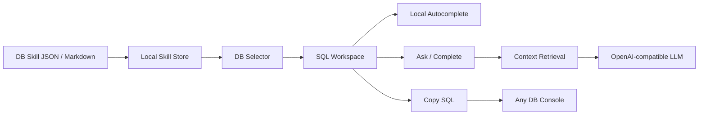

# DB Skill Copilot

DB Skill Copilot is a Chrome/Edge extension for writing SQL with DB Skill metadata. It provides an in-extension SQL workspace with DB-scoped autocomplete, natural-language SQL generation, AI completion, SQL history, and reusable templates. The final SQL is copied out and pasted into whichever database console your team already uses.

The extension deliberately avoids controlling third-party SQL editors. This keeps the product portable across database platforms, avoids fragile editor adapters, and makes the core workflow predictable: choose a DB, write in the workspace, copy the SQL, paste it into the target platform.

## Features

- SQL workspace inside the extension side panel.
- DB selector based on imported `database` fields.
- Local autocomplete for SQL keywords, table names, columns, and metrics.
- Natural-language SQL generation through DeepSeek or any OpenAI-compatible API.
- AI completion based on the current workspace SQL.
- DB Skill import through JSON or Markdown.
- Retrieval layer that only sends relevant tables, joins, and metrics to the model.
- SQL history for generated, completed, and template-rendered SQL.
- SQL templates with user-defined variables.
- Floating `DB` button on web pages to quickly open the side panel.

## How It Works



The extension does not connect directly to your production database. It also does not read query results. It sends only the user prompt, current workspace SQL, selected DB, and retrieved DB Skill metadata to the configured model provider.

## Installation

```bash
git clone git@github.com:SUT-GC/sql-copilot.git
cd sql-copilot
npm install
npm run build
```

Then install the extension:

1. Open `chrome://extensions`.
2. Enable Developer mode.
3. Click Load unpacked.
4. Select the `dist` directory.
5. Open any DB console page.
6. Click the `DB` floating button or open the extension side panel from the toolbar.

After code changes, run `npm run build` again and refresh the extension in `chrome://extensions`. Check the extension version there; this project bumps the version for each meaningful browser-facing change.

## Quick Start

1. Open the extension side panel.
2. Go to Settings.
3. Configure an OpenAI-compatible model provider:

```text
Base URL: https://api.deepseek.com
Model: deepseek-chat
API Key: your API key
SQL Dialect: mysql / hive / postgresql / clickhouse / trino / sparksql / generic
```

4. Go to Skill and import a DB Skill JSON or Markdown file.
5. Go to Write.
6. Select a DB from the workspace DB selector.
7. Type SQL in the workspace, for example:

```sql
select * from opact
```

8. Choose a suggestion with `Tab` or `Enter`.
9. Use Ask, Complete, Templates, and History as needed.
10. Copy the final SQL and paste it into your DB management platform.

## Workspace Autocomplete

Autocomplete runs inside the extension workspace and uses the active DB Skill:

- Table suggestions are prioritized above columns.
- The selected DB filters table and column candidates before suggestions are shown.
- `Tab` or `Enter` accepts the selected suggestion.
- `ArrowUp` and `ArrowDown` move through suggestions.

The autocomplete layer is local. It does not call the model.

## DB Skill JSON

DB Skill is the metadata layer that makes the assistant useful. Keep it focused on the tables, fields, metrics, and relationships that users actually query.

```json
{
  "name": "life_opact_skill",
  "dialect": "mysql",
  "tables": [
    {
      "database": "life_opact",
      "schema": "default",
      "name": "opact_project",
      "description": "Marketing project master table.",
      "business": "Stores marketing project metadata, status, owner, and time range. Commonly used for project search, budget analysis, and campaign reporting.",
      "grain": "One row per marketing project.",
      "refresh": "Near real time.",
      "owner": "marketing platform",
      "relatedTables": [
        {
          "table": "opact_project_budget",
          "relation": "opact_project.project_id = opact_project_budget.project_id",
          "type": "left join",
          "description": "Links a project to its budget configuration."
        }
      ],
      "columns": [
        {
          "name": "project_id",
          "type": "bigint",
          "description": "Project ID."
        },
        {
          "name": "project_name",
          "type": "varchar",
          "description": "Project name."
        },
        {
          "name": "status",
          "type": "varchar",
          "description": "Project status."
        },
        {
          "name": "create_time",
          "type": "datetime",
          "description": "Creation time."
        }
      ]
    }
  ],
  "joins": [
    {
      "left": "opact_project.project_id",
      "right": "opact_project_budget.project_id",
      "type": "left join",
      "description": "Project to budget relationship."
    }
  ],
  "metrics": [
    {
      "name": "project_count",
      "expression": "count(distinct project_id)",
      "description": "Distinct project count."
    }
  ]
}
```

Single-table JSON is also supported:

```json
{
  "database": "life_opact",
  "name": "opact_project",
  "description": "营销项目主表",
  "business": "记录营销项目基础信息、状态、负责人和时间范围。",
  "relatedTables": [
    {
      "table": "opact_project_budget",
      "relation": "opact_project.project_id = opact_project_budget.project_id",
      "type": "left join",
      "description": "关联项目预算配置"
    }
  ],
  "columns": []
}
```

### Field Reference

| Field | Required | Description |
| --- | --- | --- |
| `name` | Yes | DB Skill name, or table name for single-table JSON. |
| `dialect` | No | SQL dialect: `mysql`, `postgresql`, `hive`, `clickhouse`, `trino`, `sparksql`, or `generic`. |
| `tables` | Yes for full Skill JSON | Table metadata list. |
| `tables[].database` | Recommended | Database name used by workspace DB filtering. Multiple DB names can be separated by commas. |
| `tables[].schema` | No | Schema name when applicable. |
| `tables[].name` | Yes | Table name. |
| `tables[].description` | Recommended | Short table description. |
| `tables[].business` | Recommended | Business meaning, common use cases, and caveats. |
| `tables[].grain` | Recommended | Data grain, for example one row per order. |
| `tables[].refresh` | No | Refresh frequency. |
| `tables[].owner` | No | Owning team or contact group. |
| `tables[].relatedTables` | No | Table-level relationship hints. |
| `tables[].columns` | Recommended | Column metadata list. |
| `joins` | No | Global join relationships. |
| `metrics` | No | Business metric definitions. |

## Markdown DB Skill

Markdown import is supported for lightweight use:

```md
# DB Skill: user_analytics

## Tables

### dwd_user_register_di
User registration daily table.
- user_id (bigint): User ID
- dt (date): Partition date
- channel (varchar): Registration channel

## Relationships
- dwd_order_detail_di.user_id = dwd_user_register_di.user_id

## Metrics
- GMV: sum(pay_amount), only when pay_status = 'SUCCESS'
```

JSON is recommended for larger projects because it supports database scope, table business context, and richer relationships.

## Context Retrieval

Large DB Skills are not sent to the model as-is. Before Ask or Complete calls the model, the extension trims context:

- If the workspace SQL contains `from table_name` or `join table_name`, only those explicit tables are used.
- If no explicit table is present, relevant tables are selected from the user prompt, current SQL, column descriptions, table business descriptions, and metrics.
- If a workspace DB is selected, retrieval first filters tables to that DB.
- The prompt includes only retrieved tables, relevant joins, and relevant metrics.
- The raw imported DB Skill text is not appended to the model prompt.

This keeps prompts smaller and reduces accidental use of unrelated tables.

## Templates

Templates turn a useful SQL statement into a reusable form:

1. Paste SQL into Templates, or load the current workspace SQL.
2. Select a literal fragment such as a date, table name, status, or SQL condition.
3. Replace it with a variable like `{{start_date}}`.
4. Save the template.
5. Fill the variables next time and render SQL back into the workspace or copy it directly.

## Security Notes

- API keys are stored in `chrome.storage.local` for the MVP.
- Do not commit real API keys to the repository.
- The extension sends DB Skill metadata, the user prompt, selected DB, and current workspace SQL context to the configured model provider.
- It does not send query result data unless that data is pasted into the prompt or workspace by the user.
- For enterprise use, prefer an internal LLM gateway that handles authentication, audit logs, rate limits, and sensitive-data policy.

## Development

```bash
npm install
npm run build
```

Useful scripts:

```bash
npm run dev              # Start Vite dev server for UI work
npm run build            # Type-check and build extension into dist
npm run demo:mysql       # Start demo MySQL through Docker
npm run demo             # Start demo DB query console
npm run verify:retrieval # Verify DB Skill retrieval behavior
npm run verify:e2e       # Run extension E2E checks
```

## Verification

Run the core checks:

```bash
npm run build
npm run verify:retrieval
```

Run E2E checks with a browser:

```bash
npx playwright install chromium
npm run demo
npm run verify:e2e
```

With a real model call:

```bash
DEEPSEEK_API_KEY=sk-xxx npm run verify:e2e
```

The E2E test verifies:

- content script floating button injection.
- extension side panel loading.
- Settings persistence.
- DB Skill import.
- workspace DB selection.
- workspace autocomplete.
- SQL template save and render.
- optional DeepSeek SQL generation.
- SQL history persistence after generation.

Chrome for Testing is used for E2E because recent stable Chrome versions restrict command-line loading of unpacked extensions.

## Project Structure

```text
public/manifest.json        Chrome extension manifest
src/background.ts           MV3 background service worker
src/content.ts              floating DB button for opening the side panel
src/ui/App.tsx              side panel and options UI
src/ui/workspace.ts         workspace state helpers, DB options, autocomplete helpers
src/llm.ts                  OpenAI-compatible model calls
src/skill.ts                DB Skill parsing, suggestions, retrieval
src/storage.ts              chrome.storage helpers
demo/server.js              local MySQL query console
scripts/verify-e2e.mjs      extension E2E verification
scripts/verify-retrieval.ts retrieval verification
```

## Roadmap

- IndexedDB-backed metadata index for very large DB Skills.
- Better ranking for table-vs-column suggestions based on SQL cursor context.
- Team-shared DB Skill and template sync.
- Optional internal LLM gateway mode.
- SQL safety checks and explain/dry-run integrations.
- Import from data catalogs or metadata APIs.

## Contributing

Issues and pull requests are welcome.

Before opening a PR:

1. Keep changes focused.
2. Do not commit real API keys or company-internal secrets.
3. Run:

```bash
npm run build
npm run verify:retrieval
```

4. If the change affects browser behavior, also run:

```bash
DEEPSEEK_API_KEY=sk-xxx npm run verify:e2e
```

## License

No license has been selected yet. Add a `LICENSE` file before distributing this project publicly.
