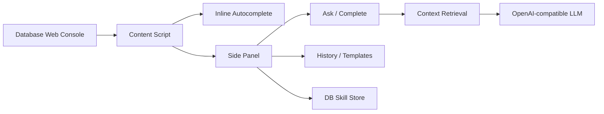

# DB Skill Copilot

DB Skill Copilot is a Chrome/Edge extension that adds SQL assistance to existing web-based database consoles. It uses a team-maintained DB Skill file to provide inline SQL autocomplete, natural-language SQL generation, SQL history, and reusable SQL templates without replacing the database platform your team already uses.

The project is currently an MVP, but it is designed around practical extension points: OpenAI-compatible model providers, DB-aware context retrieval, URL-based database scope detection, and editor adapters for third-party SQL editors.

## Features

- Inline SQL autocomplete inside supported web editors.
- Natural-language SQL generation through DeepSeek or any OpenAI-compatible API.
- AI SQL completion based on the current editor content.
- DB Skill import through Markdown or JSON.
- Database scope detection from the current URL, with manual override support.
- Retrieval layer that only sends relevant tables, joins, and metrics to the model.
- SQL history for generated, completed, and template-rendered SQL.
- SQL templates with user-defined variables.
- Demo MySQL query console for local verification.

## How It Works



The extension does not connect directly to your production database. It reads and writes SQL editor text in the browser page, then uses DB Skill metadata to help the model generate or complete SQL.

## Installation

### From Source

```bash
git clone git@github.com:SUT-GC/sql-copilot.git
cd sql-copilot
npm install
npm run build
```

Then install the extension:

1. Open `chrome://extensions`.
2. Enable Developer mode.
3. Click Load unpacked.
4. Select the `dist` directory.
5. Open a web-based DB console page.
6. Click the `DB` floating button or open the extension side panel.

After code changes, run `npm run build` again and refresh the extension in `chrome://extensions`.

## Quick Start

1. Open the extension side panel.
2. Go to Settings.
3. Configure an OpenAI-compatible model provider:

```text
Base URL: https://api.deepseek.com
Model: deepseek-chat
API Key: your API key
SQL Dialect: mysql / hive / postgresql / clickhouse / trino / sparksql / generic
```

4. Go to Skill and import a DB Skill JSON or Markdown file.
5. Open a DB console page.
6. Type in the SQL editor:

```sql
select pay_a
```

7. Choose an inline suggestion with `Tab` or `Enter`.
8. Use Ask or Complete in the side panel for larger SQL generation tasks.

## Keyboard Behavior

Inline autocomplete supports:

- `Tab` or `Enter`: accept the selected suggestion.
- `ArrowUp` / `ArrowDown`: move through suggestions.
- `Esc`: close suggestions.

Current inline autocomplete is implemented for standard `textarea` and `input` SQL editors. Monaco, CodeMirror, and Ace are detected at the DOM level today; native provider integration is a future enhancement.

## DB Skill JSON

DB Skill is the metadata layer that makes the assistant useful. Keep it focused on the tables, fields, metrics, and relationships that users actually query.

```json
{
  "name": "life_opact_skill",
  "dialect": "mysql",
  "tables": [
    {
      "database": "life_opact",
      "schema": "default",
      "name": "opact_project",
      "description": "Marketing project master table.",
      "business": "Stores marketing project metadata, status, owner, and time range. Commonly used for project search, budget analysis, and campaign reporting.",
      "grain": "One row per marketing project.",
      "refresh": "Near real time.",
      "owner": "marketing platform",
      "relatedTables": [
        {
          "table": "opact_project_budget",
          "relation": "opact_project.project_id = opact_project_budget.project_id",
          "type": "left join",
          "description": "Links a project to its budget configuration."
        }
      ],
      "columns": [
        {
          "name": "project_id",
          "type": "bigint",
          "description": "Project ID."
        },
        {
          "name": "project_name",
          "type": "varchar",
          "description": "Project name."
        },
        {
          "name": "status",
          "type": "varchar",
          "description": "Project status."
        },
        {
          "name": "create_time",
          "type": "datetime",
          "description": "Creation time."
        }
      ]
    }
  ],
  "joins": [
    {
      "left": "opact_project.project_id",
      "right": "opact_project_budget.project_id",
      "type": "left join",
      "description": "Project to budget relationship."
    }
  ],
  "metrics": [
    {
      "name": "project_count",
      "expression": "count(distinct project_id)",
      "description": "Distinct project count."
    }
  ]
}
```

### Field Reference

| Field | Required | Description |
| --- | --- | --- |
| `name` | Yes | DB Skill name. |
| `dialect` | No | SQL dialect: `mysql`, `postgresql`, `hive`, `clickhouse`, `trino`, `sparksql`, or `generic`. |
| `tables` | Yes | Table metadata list. |
| `tables[].database` | Recommended | Database name used by scope filtering. |
| `tables[].schema` | No | Schema name when applicable. |
| `tables[].name` | Yes | Table name. |
| `tables[].description` | Recommended | Short table description. |
| `tables[].business` | Recommended | Business meaning, common use cases, and caveats. |
| `tables[].grain` | Recommended | Data grain, for example one row per order. |
| `tables[].refresh` | No | Refresh frequency. |
| `tables[].owner` | No | Owning team or contact group. |
| `tables[].relatedTables` | No | Table-level relationship hints. |
| `tables[].columns` | Recommended | Column metadata list. |
| `joins` | No | Global join relationships. |
| `metrics` | No | Business metric definitions. |

## Markdown DB Skill

Markdown import is also supported for lightweight use:

```md
# DB Skill: user_analytics

## Tables

### dwd_user_register_di
User registration daily table.
- user_id (bigint): User ID
- dt (date): Partition date
- channel (varchar): Registration channel

## Relationships
- dwd_order_detail_di.user_id = dwd_user_register_di.user_id

## Metrics
- GMV: sum(pay_amount), only when pay_status = 'SUCCESS'
```

JSON is recommended for larger projects because it supports database scope, table business context, and richer relationships.

## Database Scope Detection

The extension tries to infer the current database from the active page URL.

For example:

```text
https://cloud.bytedance.net/rds/detail/db/global/life_opact/autoSQL
```

is parsed as:

```json
{
  "database": "life_opact"
}
```

When a database is detected, autocomplete and LLM retrieval prefer tables whose `database` field matches it.

If the URL pattern is not recognized, use the Current DB input at the top of the side panel. Enter the DB name and save it. The extension stores a URL pattern locally and reuses it for similar pages.

## Context Retrieval

Large DB Skills are not sent to the model as-is. Before Ask or Complete calls the model, the extension trims context:

- If the current SQL contains `from table_name` or `join table_name`, only those explicit tables are used.
- If no explicit table is present, relevant tables are selected from the user prompt, current SQL, column descriptions, table business descriptions, and metrics.
- If a database is detected from the page URL, retrieval first filters tables to that database.
- The prompt includes only retrieved tables, relevant joins, and relevant metrics.
- The raw imported DB Skill text is not appended to the model prompt.

This keeps prompts smaller and reduces accidental use of unrelated tables.

## Security Notes

- API keys are stored in `chrome.storage.local` for the MVP.
- Do not commit real API keys to the repository.
- The extension sends DB Skill metadata, the user prompt, and current SQL context to the configured model provider.
- It does not send query result data unless that data is present in the SQL editor or prompt text.
- For enterprise use, prefer an internal LLM gateway that handles authentication, audit logs, rate limits, and sensitive-data policy.

## Development

```bash
npm install
npm run build
```

Useful scripts:

```bash
npm run dev              # Start Vite dev server for UI work
npm run build            # Type-check and build extension into dist
npm run demo:mysql       # Start demo MySQL through Docker
npm run demo             # Start demo DB query console
npm run verify:retrieval # Verify DB Skill retrieval behavior
npm run verify:e2e       # Run extension E2E checks
```

## Local Demo

The repository includes a simple MySQL-backed query console in `demo/server.js`.

With Docker:

```bash
npm run demo:mysql
npm run demo
```

Then open:

```text
http://127.0.0.1:5177
```

The demo page is intentionally simple. It exists to verify that the extension can read from, write to, and autocomplete inside a third-party SQL editor-like page.

## Verification

Run the core checks:

```bash
npm run build
npm run verify:retrieval
```

Run E2E checks with a real model call:

```bash
npx playwright install chromium
DEEPSEEK_API_KEY=sk-xxx npm run verify:e2e
```

The E2E test verifies:

- content script injection.
- editor insert and replace.
- demo MySQL query execution.
- Settings persistence.
- DB Skill import.
- local completion suggestions.
- inline autocomplete.
- AI completion auto-apply.
- SQL template save and render.
- DeepSeek SQL generation.
- SQL history persistence.

Chrome for Testing is used for E2E because recent stable Chrome versions restrict command-line loading of unpacked extensions.

## Project Structure

```text
public/manifest.json       Chrome extension manifest
src/background.ts          MV3 background service worker
src/content.ts             editor detection, inline autocomplete, insert/replace
src/ui/App.tsx             side panel and options UI
src/llm.ts                 OpenAI-compatible model calls
src/skill.ts               DB Skill parsing, suggestions, retrieval
src/scope.ts               URL/database scope inference
src/storage.ts             chrome.storage helpers
demo/server.js             local MySQL query console
scripts/verify-e2e.mjs     extension E2E verification
scripts/verify-retrieval.ts retrieval verification
```

## Roadmap

- Native Monaco completion provider.
- Native CodeMirror completion provider.
- IndexedDB-backed metadata index for very large DB Skills.
- Team-shared DB Skill and template sync.
- Optional internal LLM gateway mode.
- SQL safety checks and explain/dry-run integrations.
- Import from data catalogs or metadata APIs.

## Contributing

Issues and pull requests are welcome.

Before opening a PR:

1. Keep changes focused.
2. Do not commit real API keys or company-internal secrets.
3. Run:

```bash
npm run build
npm run verify:retrieval
```

4. If the change affects browser behavior, also run:

```bash
DEEPSEEK_API_KEY=sk-xxx npm run verify:e2e
```

## License

No license has been selected yet. Add a `LICENSE` file before distributing this project publicly.
